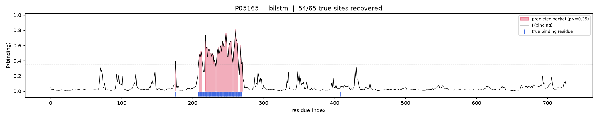

# protein-binding-esm-lora

[](https://github.com/aakashshahani/protein-binding-esm-lora/actions/workflows/ci.yml)
[](https://www.python.org)
[](LICENSE)

Per-residue prediction of protein small-molecule binding sites, built around protein language models. Given an amino-acid sequence, the model scores every residue for how likely it is to touch a small-molecule ligand. Binding residues are rare — about 2.7% of positions in this dataset — so this is a heavily imbalanced sequence-labeling problem, and most of the interesting work is in evaluating it honestly.

The project rebuilds a classical MSA/PSSM-era binding-site predictor around ESM-2 embeddings and LoRA fine-tuning, and benchmarks a ladder of models against the published CLAPE-SMB method on its own UniProtSMB split so the numbers are directly comparable.

Two things run through the whole project. The first is the modeling ladder: a BiLSTM on frozen embeddings, then a frozen encoder with a token head, then LoRA fine-tuning of the encoder itself — each rung is meant to show what the added capacity actually buys. The second is leakage discipline. Partway through I clustered the sequences and found that 46% of the published test set is homologous to the training set, which inflates every number reported on it (mine and the paper's), so I re-measured on a homology-reduced test set and with cluster-grouped cross-validation. The honest generalization number is lower than the headline, and both are reported side by side.

## Results

On the UniProtSMB test split (496 proteins, 205,848 residues, 2.70% binding), scored at the validation-selected threshold. AUPRC (area under the precision-recall curve) is the primary metric because at 2.7% positives, ROC-AUC is flattered by the large non-binding class.

| Model | AUPRC | AUROC | F1 | MCC |
|-------|-------|-------|-----|-----|
| LoRA ESM-2 650M (fine-tuned, Colab T4) | **0.715** | 0.965 | 0.673 | **0.665** |
| BiLSTM on ESM-2 650M embeddings + physicochemical | 0.654 | 0.958 | 0.623 | 0.613 |
| LoRA ESM-2 150M (fine-tuned, local 4 GB GPU) | 0.642 | 0.948 | 0.611 | 0.602 |
| Frozen ESM-2 650M + token head | 0.621 | 0.945 | 0.585 | 0.576 |
| CLAPE-SMB (published paper value, not reproduced) | — | — | — | 0.699 |

Fine-tuning the full 650M encoder with LoRA is the strongest model and lands within 0.034 MCC of the published CLAPE-SMB number; the remaining gap is plausibly their contrastive pre-training, which I did not replicate. Among the models that fit the local 4 GB card, the BiLSTM on 650M embeddings wins, because it adds sequential context and physicochemical features on top of the frozen representation.

Every "ours" number here is produced by a real run and written back from `outputs/<run>/test_metrics.json`. The CLAPE-SMB value is transcribed from the paper and labeled as such. SCRIBER and GPSite are deliberately absent: their published metrics are on different datasets, and running their tools per-residue on this split was not feasible here, so rather than print a misleading cross-dataset figure I left them out.

### The leakage finding

Clustering train and test together with MMseqs2 at 30% identity and 80% coverage shows that 228 of the 496 test proteins (46%) share a cluster with a training protein. The published split was not redundancy-reduced across train and test, so the table above is optimistic. Re-scoring on the 268 non-leaked test proteins gives a more honest estimate:

| Model | AUPRC (full → non-leaked) | MCC (full → non-leaked) |
|-------|---------------------------|--------------------------|
| BiLSTM | 0.654 → 0.573 | 0.613 → 0.539 |
| Frozen ESM-2 + head | 0.621 → 0.586 | 0.576 → 0.554 |
| LoRA ESM-2 150M | 0.642 → 0.581 | 0.602 → 0.548 |

Everything drops 0.06–0.08 AUPRC and the ranking tightens, which says the BiLSTM's apparent edge on the full test was partly homology. Cluster-grouped five-fold cross-validation on the BiLSTM agrees: AUPRC 0.567 ± 0.028, MCC 0.526 ± 0.020. So the real generalization level is about 0.57 AUPRC, not the 0.65 the leaky split suggests.

### Interpretability and generalization

<p align="center">
  
</p>

`scripts/interpret.py` renders the per-residue probability track for a protein, with predicted pockets shaded and the true binding residues marked underneath (above: P05165, 54 of 65 true sites recovered).

Trained only on UniProtSMB and evaluated on the separate IDP set with no retuning, the 150M LoRA model reaches AUPRC 0.799 and MCC 0.732 (the CLAPE-SMB paper reports MCC 0.815 on the same set), so the model transfers across datasets without adaptation.

## Tech stack

Python, PyTorch, Hugging Face Transformers, PEFT (LoRA), ESM-2, scikit-learn, NumPy, Weights and Biases, MMseqs2, biotite, FastAPI, Docker, GitHub Actions, pytest, ruff.

## The modeling ladder

```
ESM-2 650M embeddings (cached) ──▶ (a) BiLSTM + physicochemical
                               └─▶ (b) frozen encoder + token head
raw sequence ──────────────────▶ (c) LoRA fine-tune ESM-2 (150M local / 650M Colab)
```

**(a) BiLSTM baseline.** A two-layer bidirectional LSTM over per-residue ESM-2 embeddings, optionally concatenated with seven physicochemical scalars (hydrophobicity, charge, polarity, volume, and so on). This is the honest classical baseline the modern models have to beat.

**(b) Frozen encoder + head.** ESM-2 650M is left frozen and a small MLP token head is trained on its embeddings. This mirrors the CLAPE-SMB setup and is the cheap point of comparison.

**(c) LoRA fine-tuning.** Low-rank adapters are trained into the ESM-2 attention and MLP projections while the base weights stay frozen, so only about 3.6% of parameters are learned. This is what makes fine-tuning fit small GPUs. The 150M variant trains on the local 4 GB card; the 650M flagship trains on a free Colab T4.

Binding residues are rare, so all models train with focal loss by default (weighted BCE is also available), and the decision threshold is chosen on validation, never on test.

## Data and anti-leakage

The benchmark is UniProtSMB, taken from the [CLAPE-SMB](https://github.com/JueWangTHU/CLAPE-SMB) repository (a snapshot of reviewed UniProtKB proteins with 3D structures and small-molecule binding sites, dated 2024-04-17). I reuse their exact train/validation/test split so the numbers are directly comparable to the paper, and `download_data.py` pins the repository to a concrete commit and records a SHA-256 of every file in `data/DATA_RELEASE.json`. Records are three lines each: an identifier, the sequence, and a per-residue string of 0s and 1s.

Independently of the published split, `cluster_split.py` runs MMseqs2 at 30% identity to audit train–test homology (the 46% finding above) and to build cluster-grouped cross-validation folds so homologs never span folds. Large files — raw data, embeddings, checkpoints — are gitignored and regenerated by scripts.

## Serving

A FastAPI service turns a sequence into per-residue probabilities. Embeddings are computed on demand and cached, and the model loads lazily from `PBSITE_MODEL_DIR`, so the app and its health check run even before anything is trained.

```bash
export PBSITE_MODEL_DIR=outputs/frozen_head_esm2_t33_650M_UR50D
uvicorn pbsite.serve.api:app --port 8000

curl -s localhost:8000/predict -H 'content-type: application/json' \
     -d '{"sequence":"MKTAYIAKQR"}'
```

`GET /health` reports readiness; `POST /predict` returns per-residue probabilities and the residues predicted to bind. There is a Dockerfile under `docker/` for a standalone CPU image.

## Project structure

```
protein-binding-esm-lora/
  configs/       data + model configs (seeds, releases, LR grids)
  data/          gitignored raw + processed cache; release manifest and data card committed
  scripts/       download_data, build_dataset, cluster_split, extract_embeddings,
                 train, evaluate, evaluate_lora, cross_validate, interpret, structure_analysis
  src/pbsite/
    data/        UniProtSMB parsing, MMseqs2 clustering + grouped splits, UniProt/BioLiP2
    features/    ESM-2 embeddings, physicochemical, AlphaFold structure (RSA + SS)
    models/      BiLSTM, frozen head, LoRA classifier, masked focal / weighted-BCE losses
    eval/        per-residue metrics, benchmark table
    serve/       FastAPI app, predictor, schemas
  tests/         CPU unit tests + tiny fixtures, run in CI
  docker/        serving image
  notebooks/     colab_lora.ipynb (650M flagship, Drive-checkpointed for a free T4)
  .github/       GitHub Actions CI (ruff + pytest)
```

## Reproduce

```bash
python -m venv .venv && . .venv/Scripts/activate      # macOS/Linux: source .venv/bin/activate
# NVIDIA GPU: install the CUDA build of torch first
pip install -r requirements-gpu.txt --index-url https://download.pytorch.org/whl/cu124
pip install -r requirements.txt && pip install -e .

python scripts/download_data.py  --config configs/data.yaml   # pinned UniProtSMB split
python scripts/build_dataset.py  --config configs/data.yaml   # data card
python scripts/cluster_split.py  --config configs/data.yaml   # MMseqs2 leakage audit + CV folds
python scripts/extract_embeddings.py --config configs/bilstm.yaml --splits train valid test

python scripts/train.py --config configs/bilstm.yaml
python scripts/train.py --config configs/frozen_head.yaml
python scripts/train.py --config configs/lora.yaml --track local   # 150M on a 4 GB GPU
# 650M LoRA flagship: notebooks/colab_lora.ipynb on a free Colab T4

python scripts/evaluate.py --run outputs/bilstm_esm2_t33_650M_UR50D
python scripts/cross_validate.py --config configs/bilstm.yaml       # cluster-grouped CV
```

Seeds are fixed in the configs and in `pbsite.utils.set_seed`. Weights and Biases runs in offline mode by default, so no account is needed; `wandb sync` uploads later. The MMseqs2 step uses a native binary or Docker if present, and works from a static Linux binary under WSL otherwise. The stretch-goal scripts (`interpret.py`, `structure_analysis.py`) need `pip install -r requirements-stretch.txt`.

## Hardware notes

Developed on an NVIDIA GTX 1650 with 4 GB of memory. Extracting ESM-2 650M embeddings fits in fp16 at batch size one, with long sequences windowed, and the BiLSTM and frozen-head models train comfortably on the cached embeddings. LoRA fine-tuning of the 650M encoder does not fit for training on 4 GB, so the local LoRA run uses ESM-2 150M and the 650M flagship runs on a free Colab T4 (16 GB); the results table labels each row by the hardware that produced it.

## Structure features and scope

`pbsite/features/structure.py` pulls predicted structures from AlphaFold DB (resolving the current model version through the API) and computes per-residue relative solvent accessibility and three-state secondary structure with biotite. On a sample of the test set, binding residues are clearly more buried than non-binding ones (mean RSA 0.20 versus 0.29) and are enriched in coil, which is the expected pocket-and-loop signal and confirms the features carry usable information.

I stop there rather than retraining with these features. ESM-2 already encodes a lot of structure implicitly, so adding four explicit structural features next to a 1,280-dimensional embedding is likely to give marginal lift, and it would cost several thousand structure downloads and a retrain to find out. The pipeline and the descriptive result are the honest stopping point.

## Beyond binding sites

The hard part here is not ligands specifically, it is per-residue labeling of a rare class where sequence homology quietly leaks between splits. The same shape shows up across computational biology — catalytic residues, post-translational modification sites, epitopes, disordered regions — and the same machinery transfers: language-model embeddings, parameter-efficient fine-tuning, identity-based clustering to prevent leakage, grouped cross-validation, and threshold-free metrics for the imbalance.

## License

[MIT](LICENSE)

## Acknowledgements

CLAPE-SMB (Wang et al., Journal of Cheminformatics, 2024) for the UniProtSMB dataset and split; ESM-2 (Lin et al., 2023); AlphaFold DB (EMBL-EBI); BioLiP2 (Zhang group).
